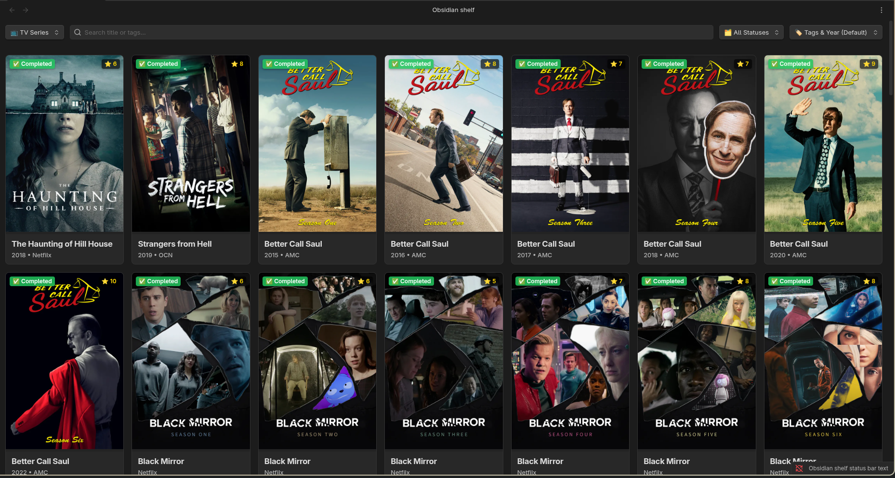
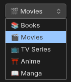
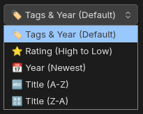
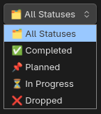
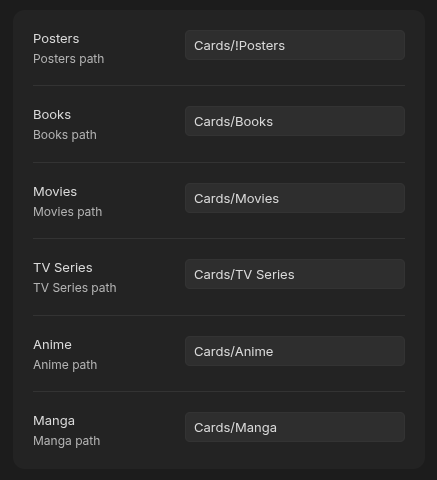

# 📚 Obsidian Shelf

<p align="center">
  <a href="#"></a>
  <a href="#"></a>
  <a href="https://opensource.org/licenses/MIT"></a>
</p>

**Obsidian Shelf** — это мощный плагин для Obsidian, который превращает вашу базу знаний в красивую, удобную и визуально приятную библиотеку медиа. Отслеживайте свои книги, фильмы, сериалы, аниме и мангу с помощью стильных карточек в виде канбан-сетки.

<p align="center">
  
</p>

---

## ✨ Возможности

- **Визуальная эстетика:** Красивая сетка карточек с поддержкой постеров, бейджей статуса и рейтинга.
- **Поддержка различных категорий:** Раздельный учет для 📚 Книг, 🎬 Фильмов, 📺 Сериалов, ⛩️ Аниме и 📖 Манги.
- **Умный поиск и фильтрация:** Ищите по названию или тегам, фильтруйте контент по статусам (📌 *Planned*, ⏳ *In Progress*, ✅ *Completed*, ❌ *Dropped*).
- **Продвинутая сортировка:** Сортируйте библиотеку по рейтингу, дате выхода, названию (А-Я) или тегам.
- **Высокая производительность:** Поддержка библиотек любого размера благодаря "ленивой загрузке" (Infinite Scroll / IntersectionObserver) — рендерится только то, что вы видите.

<p align="center">
  
  
  
</p>

## ⚙️ Настройка и использование

### 1. Настройка папок (Settings)

В настройках плагина необходимо указать пути к папкам, где хранятся ваши заметки и постеры (по умолчанию это `Books`, `Movies`, `Posters` и т.д.).

### 2. Добавление постеров

Постеры должны лежать в папке, указанной в настройках (например, `Posters/movie/название_файла.webp`). Название файла постера должно точно совпадать с названием `.md` файла заметки.

### 3. Формат заметок (Frontmatter)

Плагин автоматически читает свойства (properties/frontmatter) ваших заметок. Чтобы карточка корректно отображалась на полке, добавьте в начало `.md` файла следующие метаданные:

```yaml
---
title: Название произведения
type: movie # Допустимые значения: book, movie, tv_series, anime, manga
status: planned # Допустимые значения: planned, in_progress, completed, dropped
rating: 9
year: 2023
author: Имя Режиссера / Автора
tags:
  - fantasy
  - sci-fi
---
```

### 4. Окно Настроек

У плагина есть ряд настроек для быстрого доступа к вашей библиотеке и постерам:

<p align="center">
  
</p>

## 🚀 Установка

### Через Obsidian (Community Plugins)

*Временно недоступно, плагин находится на стадии активной разработки.*

### Ручная установка

1. Скачайте последний релиз из раздела [Releases](https://www.google.com/search?q=https://github.com/YOUR_USERNAME/obsidian-shelf/releases&utm_source=gemini).
2. Распакуйте архив в папку `.obsidian/plugins/obsidian-shelf` внутри вашего хранилища (vault).
*(Убедитесь, что папка содержит файлы `main.js`, `manifest.json` и `styles.css`)*.
3. Перезапустите Obsidian.
4. Зайдите в **Settings** > **Community plugins**, отключите безопасный режим (Safe mode) и включите **Obsidian Shelf**.

## 🛠️ Разработка (Для контрибьюторов)

Проект написан на TypeScript с использованием современного Obsidian API.

```bash
# Клонировать репозиторий
git clone [https://github.com/YOUR_USERNAME/obsidian-shelf.git](https://github.com/YOUR_USERNAME/obsidian-shelf.git)

# Установить зависимости
npm install

# Запустить режим разработчика (автоматическая сборка при изменениях)
npm run dev

# Собрать релизную версию
npm run build

```

## 📜 Лицензия

Проект распространяется под лицензией [MIT License](https://www.google.com/search?q=LICENSE&utm_source=gemini).

```

**Что нужно будет сделать вам перед публикацией:**
1. Заменить все `YOUR_USERNAME` на ваш реальный никнейм на GitHub.
2. В блоках `> 🖼️ **Скриншот ...**` удалить текст-подсказку и раскомментировать/вставить markdown-ссылку на загруженные картинки. Рекомендую создать в корне репозитория папку `assets` или `images`, положить туда картинки и ссылаться на них как ``.

```
