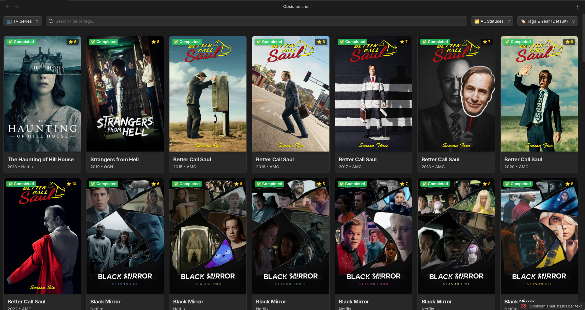

# 📚 Obsidian Shelf

<p align="center">
  <a href="#"></a>
  <a href="#"></a>
  <a href="https://opensource.org/licenses/MIT"></a>
</p>

**Obsidian Shelf** — is a powerful plugin for Obsidian that turns your knowledge base into a beautiful, convenient, and visually appealing media library. Track your books, movies, TV shows, anime, and manga using stylish cards in the form of a kanban grid.

<p align="center">
  
</p>

---

## ✨ Opportunities

- **Visual aesthetics:** A beautiful card grid with support for posters, status badges, and ratings.
- **Support for various categories:** Separate tracking for 📚 Books, 🎬 Movies, 📺 TV series, ⛩️ Anime, and 📖 Manga.
- **Smart search and filtering:** Search by name or tags, filter content by status (📌 *Planned*, ⏳ *In Progress*, ✅ *Completed*, ❌ *Dropped*).
- **Advanced sorting:** Sort the library by rating, release date, name (A-Z), or tags.
- **High performance:** Supports libraries of any size thanks to “lazy loading” (Infinite Scroll / IntersectionObserver) — only what you see is rendered.

<p align="center">
  
  
  
</p>

## ⚙️ Configuration and Usage

### 1. Folder Configuration (Settings)

In the plugin settings, you must specify the paths to the folders where your notes and posters are stored (by default, these are `Books`, `Movies`, `Posters`, etc.).

### 2. Adding posters

The posters should be in the folder specified in the settings (for example, `Posters/movie/file_name.webp`). The name of the poster file must exactly match the name `.md` of the note file.

### 3. Note Format (Frontmatter)

The plugin automatically reads the properties (properties/frontmatter) of your notes. To ensure the card is displayed correctly on the shelf, add the following metadata to the beginning of the `.md` file:

```yaml
---
title: Title of the work
type: movie # Valid values: book, movie, tv_series, anime, manga
status: planned # Valid values: planned, in_progress, completed, dropped
rating: 9
year: 2023
author: Director / Author's name
tags:
  - fantasy
  - sci-fi
---
```

### 4. Settings Window

The plugin has a number of settings for quick access to your library and posters:

<p align="center">
  
</p>

## 🚀 Installation

### Through Obsidian (Community Plugins)

*Temporarily unavailable, the plugin is under active development.*

### Manual installation

1. Download the latest release from the section [Releases](https://www.google.com/search?q=https://github.com/GhOsTiK56/obsidian-shelf/releases&utm_source=gemini).
2. Unzip the archive to the `.obsidian/plugins/obsidian-shelf` folder inside your vault.
*(Make sure that the folder contains the `main' files.js`, `manifest.json` and `styles.css`)*.
3. Restart Obsidian.
4. Go to **Settings** > **Community plugins**, disable Safe mode and enable **Obsidian Shelf**.

## Development (For contributors)

The project is written in TypeScript using the modern Obsidian API.

```bash
# Clone the repository
git clone [https://github.com/GhOsTiK56/obsidian-shelf.git](https://github.com/GhOsTiK56/obsidian-shelf.git)

# Install dependencies
npm install

# Run developer mode (automatic build on changes)
npm run dev

# Build the release version
npm run build

```

## 📜 License

The project is distributed under the [MIT License](https://www.google.com/search?q=LICENSE&utm_source=gemini).

**What you will need to do before publishing:**

1. Replace all `YOUR_USERNAME` with your real GitHub username.
2. In the blocks `> 🖼️ **Screenshot ...**` delete the hint text and uncomment/insert the markdown link to the uploaded images. I recommend creating a folder named `assets` or `images` at the root of the repository, placing the images there, and referencing them as ``.
